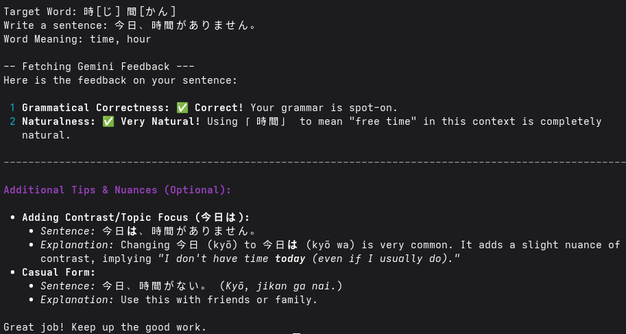

# Anki Gemini Sentence Tutor

A Python CLI tool that pulls a random word you've previously reviewed from your local Anki collection and uses Google's Gemini API to evaluate a custom Japanese sentence you write for grammar, natural phrasing, and context.

## Example Output


## Prerequisites
- Python 3
- Anki Desktop
- A free Gemini API key from [Google AI Studio](https://aistudio.google.com/)

## Installation
1.  Clone the repository:
    ```
    git clone https://github.com/clearcasting/anki-sentence.git
    cd anki-sentence
    ```

2.  Create and activate a virtual environment:
    ```
    python -m venv venv
    source venv/bin/activate
    # On Windows: venv\Scripts\activate
    ```

3. Install dependencies:
    ```
    pip install -r requirements.txt
    ```
## Configuration
1. Set up Environment Variables:
    ```
    cp .env.example .env
    ```

2. Add your Gemini API Key:
    ```
    # Open .env and paste your actual API key
    GEMINI_API_KEY=your_actual_api_key_here
    ```

3. Verify Anki Path and Deck Settings:
    ```
    # Replace the collection path in .env to match your collection path
    # This changes depending on your OS
    COLLECTION_PATH="/home/user/.local/share/Anki2/User 1/collection.anki2"
    ```

## Usage
1. Run the script:
    ```
    python main.py
    ```